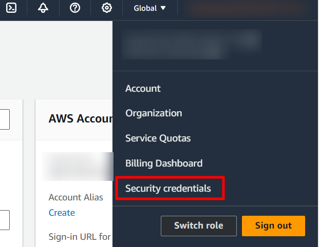
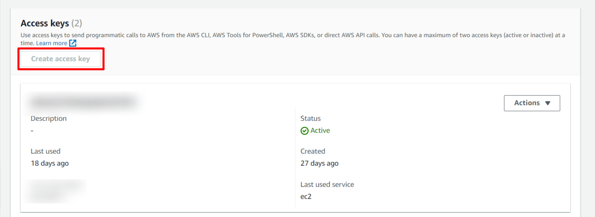
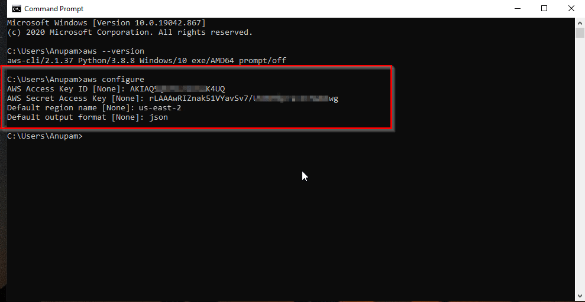

## Security Tools

### PHPStan

PHPStan is a static analysis system for PHP projects. It scans your entire codebase and looks for both obvious and tricky bugs, even in rarely executed if statements that aren’t covered by tests. It can be run on your machine and in CI to prevent bugs from reaching your customers in production. PHPStan is open-source, free, and offers extensions for popular frameworks like Symfony, Laravel, or Doctrine. It also understands code that takes advantage of magic methods and properties.

### OWASP Dependency Check

OWASP Dependency Check is a Software Composition Analysis (SCA) tool that detects publicly disclosed vulnerabilities contained within a project’s dependencies. It does this by determining if there is a Common Platform Enumeration (CPE) identifier for a given dependency. If found, it generates a report linking to the associated CVE entries. Dependency Check can be used to scan applications (and their dependent libraries) to identify any known vulnerable components. It helps address the problem of using known vulnerable components in applications, which can pose security risks.

### OWASP ZAP

OWASP ZAP (Zed Attack Proxy) is the world’s most widely used web app scanner. It is a free and open-source tool actively maintained by a dedicated international team of volunteers. ZAP helps identify security vulnerabilities in web applications by scanning them for potential weaknesses. It provides a range of options for security automation and has add-ons contributed by the community to extend its functionality.

## CodeCommit Configuration

Step 1: Create an IAM User with AWSCodeCommitPowerUser policy.


Step 2: Create Repositories


Step 3: Add your SSH keys to the newly created user in Step 1 security credentials. Up to 5 SSH can be added per IAM user.


Step 4: Again under Security Credentials for HTTPS access to your repositories you need to generate git credentials for your account. 


Step 5: Copy the username and password that IAM generated for you, either by showing, copying, and then pasting this information into a secure file on your local computer, or by choosing Download credentials to download this information as a .CSV file. You need this information to connect to CodeCommit.

Step 6: Check your connection by cloning one of the repositories.

----

## ECR (Elastic Container Registry) Setup

Step 1: Go over to ECR and create a private repository with a name of your choosing.


Step 2: Next, go to Permissions>Edit JSON Policy and delete the default and set the following permissions for the repository

```json
{
  "Version": "2012-10-17",
  "Statement": [
    {
      "Effect": "Allow",
      "Principal": "*",
      "Action": [
        "ecr:BatchGetImage",
        "ecr:DescribeImages",
        "ecr:GetDownloadUrlForLayer",
        "ecr:PullImage"
      ]
    }
  ]
}
```

----

## S3 Bucket Configuration

Step 1: Go over to S3 and create a private bucket for the project. Check if the settings matches the following screenshots and keep the defaults for rest of the configurations.


 

## Terraform Setup

We need terraform to setup an EKS and RDS cluster for this project. Follow the steps below to setup terraform:

**For Ubuntu/Debian:**

Step 1: Install  `gnupg`, `software-properties-common`, and `curl` packages by running the following commands.

```bash
sudo apt-get update && sudo apt-get install -y gnupg software-properties-common
```

Step 2:  Install HashiCorp GPG Key.

```bash
wget -O- https://apt.releases.hashicorp.com/gpg | \
gpg --dearmor | \
sudo tee /usr/share/keyrings/hashicorp-archive-keyring.gpg
```

Step 3: Add the HashiCorp repository to your package manager.

```bash
echo "deb [signed-by=/usr/share/keyrings/hashicorp-archive-keyring.gpg] \
https://apt.releases.hashicorp.com $(lsb_release -cs) main" | \
sudo tee /etc/apt/sources.list.d/hashicorp.list
```

Step 4: Update packages and install Terraform.

```bash
sudo apt update && sudo apt-get install terraform
```

**For RHEL:**

Step 1: Install `yum-utils` package.

```bash
sudo yum install -y yum-utils
```

Step 2: Use `yum-config-manager` to add HashiCorp repository to your package manager.

```bash
sudo yum-config-manager --add-repo https://rpm.releases.hashicorp.com/RHEL/hashicorp.repo`
```

Step 3: Finally, install terraform from the newly added repository.

```bash
sudo yum -y install terraform
```

### AWS CLI setup

For various tasks in this project we will need to interact with AWS services and resources from our local machine. Therefore, we need to install AWS CLI and configure it properly in our system. Follow the steps below for installing and configuring the AWS CLI.

> **Note:** If you are using an EC2 instance with Amazon linux images aws cli should already be installed in the system. In that case, skip the installtions steps.

**Step 1:**  Make sure `curl` and `unzip` is installed in the system.

**For Ubuntu/Debian:**

```bash
sudo apt update && sudo apt-get install -y curl unzip
```

**For RHEL:**

```bash
sudo yum install -y curl unzip
```

**Step 2:** Download the install script for aws-cli

```bash
curl "https://awscli.amazonaws.com/awscli-exe-linux-x86_64.zip" -o "awscliv2.zip"
```

**Step 3:** Unzip and run the install script.

```bash
unzip awscliv2.zip
sudo ./aws/install
```

**Step 4:** Run the following command to check the version of installed aws cli:

```bash
aws --version
```

**Step 5:** Run the following command to start configuring AWS CLI.

```bash
aws configure
```

**Step 6:** For configuring the aws cli you will need an Access key and Secret access key pair associated with your account. If you don't have an access key, login to your aws account and go to security credentials.





Create an access key for aws command line interface. Download the access key after generation and save it in a safe place because the secret key can't be obtained later.

**Step 7:** Use the access key and secret access kye to configure the AWS CLI. The configuration should look like the image below.



## Kubectl setup

To interact with the EKS cluster we would need to setup `kubectl`. Follow the steps below:

**Step 1:** Run the following command to download kubectl binary.

```bash
curl -LO "https://dl.k8s.io/release/$(curl -L -s https://dl.k8s.io/release/stable.txt)/bin/linux/amd64/kubectl"
```

**Step 2:**  Afterwards, run the following command to install kubectl as the root user.

```bash
sudo install -o root -g root -m 0755 kubectl /usr/local/bin/kubectl
```

**Step 3:** Check `kubectl` is working by running a version check

```bash
kubectl version --client
```

## EKS and RDS Cluster Provisioning with Terraform

Assuming you have already installed and setup `terraform`, `aws-cli` & `kubectl` we can provision the EKS and RDS Cluster using the provided terraform code.

**Step 1:** Clone the terraform code repo

```bash
git clone <terraform-public repo>
```

**Step 2:**  Go to the root directory and run the following command

```bash
terraform init
```

**Step 3:** Next, run the following command to generate a plan before provisioning

```bash
terraform plan
```

**Step 4:** Thoroughly check the plan and run the following command to apply and start the provisioning process.

```bash
terraform apply -auto-approve
```

**Step 5:** After provisioning is completed. you should see the cluster name and region. Now, we need to get the `kubeconfig` file to communicate with the EKS control-plane. We can do so with the help of `aws-cli`. Run the following command to update the kubeconfig file.

```bash
aws eks update-kubeconfig --name <eks-cluster-name> --region <aws-region-name>
```

**Step 6:** Check if the kubectl can communicate with the cluster by running the following coommand:

```bash
kubectl cluster-info
```

AWS EKS Setup

Configure the following in the machine you are going to access the cluster:  

- AWS CLI

- AWS IAM Authenticator

- Kubectl

Run the following command to get kubeconfig file for the new cluster:

Linux:

aws eks –region $(terraform output -raw region) update-kubeconfig --name $(terraform output -raw cluster_name)

Windows:

set region_code=region-code

set cluster_name=my-cluster

set account_id=111122223333

for /f "tokens=*" %%a in ('aws eks describe-cluster --region %region_code% --name %cluster_name% --query "cluster.endpoint" --output text') do set cluster_endpoint=%%a

for /f "tokens=*" %%a in ('aws eks describe-cluster --region %region_code% --name %cluster_name% --query "cluster.certificateAuthority.data" --output text') do set certificate_data=%%a

aws eks update-kubeconfig --region %region_code% --name %cluster_name%

aws eks –region ap-southeast-1 update-kubeconfig –name vaccination-system-eks

# AWS Load balancer Controller Configuration

## Create Identity provider

Step 1: Copy OpenIDConnect URL from EKS overview


Step 2: Go to IAM console>Identity Provider and create a OpenID Connect provider using the connector provider URL copied in the earlier step. Use sts.amazonaws.com as the audience.

Step 3: Now create an IAM policy from AWS load balancer controller documentation for the version you are using. I am using v2.6.1 in this project.  
https://github.com/kubernetes-sigs/aws-load-balancer-controller/blob/v2.6.1/docs/install/iam_policy.json
